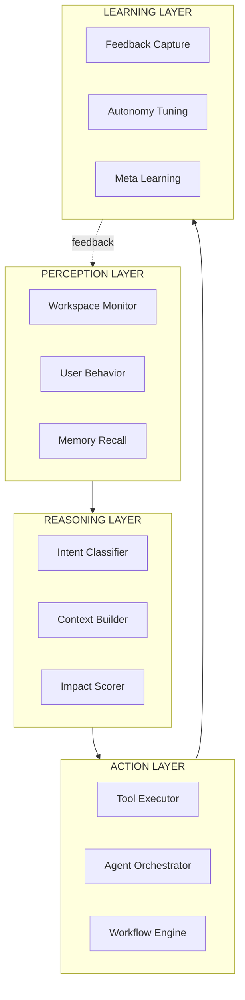
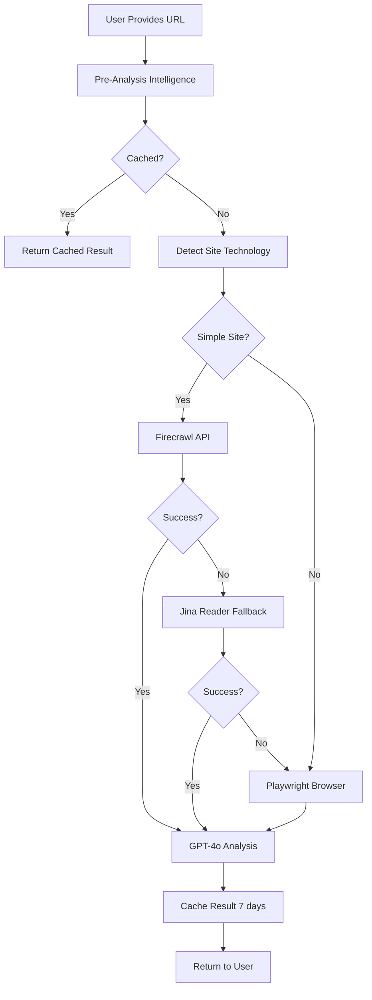
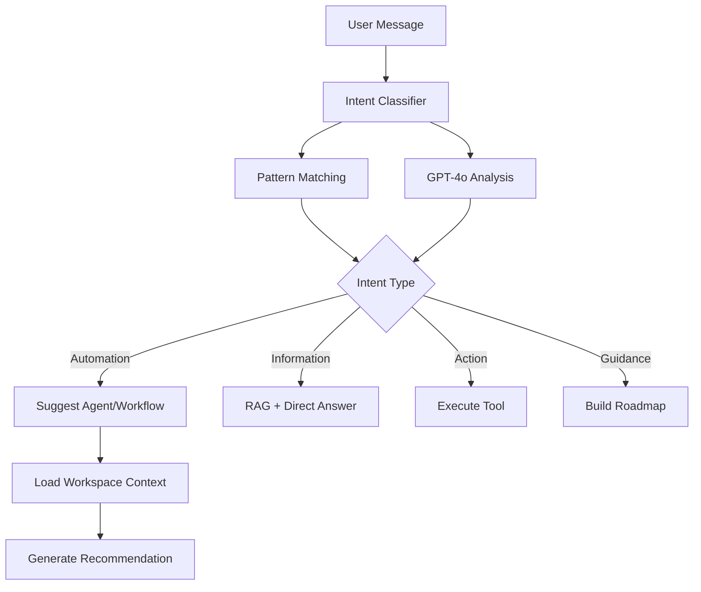

# Neptune Transformation: From Chatbot to AI Chief of Staff (v2.0)

**Combined Analysis:** Cursor AI + Claude Desktop insights**Timeline:** 3 weeks (solo founder + AI pair programmers)**Deployment:** Test locally, git push at each milestone to production---

## Architecture Vision: Neptune Command Center



**Key Principles:**

- **Layered Decoupling**: Separate perception, reasoning, action, learning
- **Governed Autonomy**: Policies + permissions + escalation
- **Proactive Detection**: Find issues before user notices
- **Persistent Memory**: Context across sessions
- **Meta-Learning**: Improve from outcomes

---

## Prerequisites & Setup

### API Keys (Get Before Starting)

1. **Firecrawl API Key** - PRIMARY (CRITICAL)

- URL: https://firecrawl.dev
- Plan: Growth ($49/mo, 5,000 scrapes)
- Add to `.env.local`: `FIRECRAWL_API_KEY=fc-xxx`
- Test: `curl -X POST https://api.firecrawl.dev/v0/scrape -H "Authorization: Bearer $FIRECRAWL_API_KEY"`

2. **OpenAI API Key** - Already configured

- Verify: `echo $OPENAI_API_KEY`

3. **Optional Enhancement:**

- Google Custom Search API (free: 100/day)
- For company info enrichment

### Development Dependencies

```bash
# Install Playwright for robust website crawling
npm install -D @playwright/test
npx playwright install chromium

# Verify environment
npm run verify-env
npm run dev
```

---

## WEEK 1: CRITICAL FIXES + INTELLIGENCE LAYER

### Phase 1A: Robust Website Analysis (Days 1-2)

**Goal:** 95%+ success rate with intelligent fallbacks

#### Architecture Update




#### New Files to Create:

1. **`src/lib/ai/website-crawler-playwright.ts`** (NEW)

- Headless browser for JS-heavy sites
- Handles SPAs (React, Vue, Angular)
- Screenshot capability for visual context
- ~200 lines

2. **`src/lib/ai/website-intelligence.ts`** (NEW)

- Pre-analysis tech detection
- Site type classification
- Optimal method selection
- ~150 lines

#### Files to Modify:

1. **[`src/lib/ai/website-analyzer.ts`](src/lib/ai/website-analyzer.ts)**

- Reorder: Cache → Firecrawl → Playwright → Jina → Direct
- Add exponential backoff (3 retries per method)
- Better error messages per Claude's suggestion
- Lines affected: 234-650

2. **[`src/lib/ai/tools.ts`](src/lib/ai/tools.ts)** - `analyze_company_website`

- Remove fake success responses (lines 8194-8213)
- Return honest failures with helpful suggestions
- Suggest alternatives when crawl fails
- Add cache check FIRST

3. **[`src/lib/cache.ts`](src/lib/cache.ts)**

- Add `cacheWebsiteAnalysis(url, data, ttl=7days)`
- Key format: `website:analysis:${normalizedUrl}`

#### Implementation Details:

```typescript
// New: website-crawler-playwright.ts
import { chromium } from '@playwright/test';

export async function crawlWithPlaywright(url: string): Promise<string> {
  const browser = await chromium.launch({ headless: true });
  const page = await browser.newPage();
  
  try {
    await page.goto(url, { waitUntil: 'networkidle', timeout: 15000 });
    
    // Wait for common frameworks to hydrate
    await page.waitForTimeout(2000);
    
    // Extract clean text content
    const content = await page.evaluate(() => {
      // Remove script, style, nav, footer
      const unwanted = ['script', 'style', 'nav', 'footer', 'header'];
      unwanted.forEach(tag => {
        document.querySelectorAll(tag).forEach(el => el.remove());
      });
      return document.body.innerText;
    });
    
    return content;
  } finally {
    await browser.close();
  }
}

// Enhanced error messages per Claude
if (!content || content.length < 200) {
  return {
    success: false,
    message: `I couldn't access ${domainName} directly. This often happens with:
    • JavaScript-heavy sites (React, Vue, Angular)
    • Sites with bot protection (Cloudflare, etc.)
    • Sites requiring authentication
    
    **Alternatives:**
    1. Tell me about your company in 2-3 sentences
    2. I can search for public information about ${domainName}
    3. Provide a direct link to your About page`,
    suggestedActions: ['search_company_info', 'manual_input'],
  };
}
```


#### Testing Checklist:

- [ ] Test 10 real websites (SaaS, Agency, E-commerce)
- [ ] Test JS-heavy sites (verify Playwright works)
- [ ] Verify cache (2nd request instant)
- [ ] Test all fallback paths
- [ ] Verify error messages are helpful
- [ ] Performance: under 10 seconds per analysis

#### Git Milestone:

```bash
git add src/lib/ai/website-*.ts src/lib/ai/tools.ts src/lib/cache.ts
git commit -m "feat(neptune): robust website analysis with Playwright + intelligent fallbacks"
git push origin main
```

---

### Phase 1B: Intent Classification System (Day 2-3)

**Goal:** Neptune detects automation opportunities proactively

#### New Architecture Component: Intent Classifier




#### New Files to Create:

1. **`src/lib/ai/intent-classifier.ts`** (NEW - CRITICAL)

- Detect automation opportunities
- Match to agent templates
- Assess workspace readiness
- ~300 lines
```typescript
export interface IntentClassification {
  intent: 'automation' | 'information' | 'action' | 'guidance' | 'creation';
  confidence: number;
  suggestedTools: string[];
  contextNeeded: string[];
  proactiveResponse?: string;
}

export async function classifyIntent(
  message: string,
  workspaceContext: AIContextData
): Promise<IntentClassification> {
  // Pattern-based classification (fast)
  const patterns = {
    automation: [/automat/, /repetitive/, /every time/, /always have to/],
    agentCreation: [/create.*agent/, /build.*agent/, /need.*agent/],
    leadFollowup: [/follow.?up/, /reach out/, /contact.*lead/],
  };
  
  // GPT-4o mini for complex intent detection
  const gptClassification = await openai.chat.completions.create({
    model: 'gpt-4o-mini',
    messages: [{
      role: 'system',
      content: `Classify user intent and suggest proactive actions.
      Workspace: ${workspaceContext.crm.totalLeads} leads, ${workspaceContext.agents.activeAgents} agents`
    }, {
      role: 'user',
      content: message
    }],
    response_format: { type: 'json_object' }
  });
  
  return parseClassification(gptClassification);
}
```


#### Files to Modify:

1. **[`src/app/api/assistant/chat/route.ts`](src/app/api/assistant/chat/route.ts)**

- Add intent classification BEFORE GPT-4o call (after line 361)
- Inject proactive suggestions into system prompt
- Route to specialized handlers

2. **[`src/lib/ai/system-prompt.ts`](src/lib/ai/system-prompt.ts)**

- Add intent-aware response templates
- Inject proactive triggers based on classification

#### Testing Checklist:

- [ ] "I need help with lead follow-up" → detects automation intent
- [ ] "Create a sales agent" → detects agent creation intent
- [ ] "What's in my pipeline?" → detects information intent
- [ ] Proactive suggestions appear naturally
- [ ] Classification under 200ms

#### Git Milestone:

```bash
git add src/lib/ai/intent-classifier.ts src/app/api/assistant/chat/route.ts
git commit -m "feat(neptune): add intent classification for proactive suggestions"
git push origin main
```

---

### Phase 1C: One-Shot Smart Agent Creation (Day 3-4)

**Goal:** Create agents in 1-2 messages using natural language + templates

#### New Files to Create:

1. **`src/lib/ai/agent-wizard.ts`** (NEW - per Claude's suggestion)

- Conversational agent creation flow
- Template discovery and matching
- Capability inference from goals
- ~400 lines

2. **`src/lib/ai/agent-templates.ts`** (NEW)

- 10 pre-built templates (Sales, Support, Research, etc.)
- Template matching logic
- Default configurations

#### Files to Modify:

1. **[`src/lib/ai/tools.ts`](src/lib/ai/tools.ts)**

- Add `create_agent_smart` tool (replaces multi-question flow)
- Uses GPT-4o-mini to infer config from goal
- Leverages templates when applicable
- Auto-generates: name, type, description, capabilities
```typescript
// New tool definition
{
  type: 'function',
  function: {
    name: 'create_agent_smart',
    description: `Create AI agent from natural language goal. Uses templates and AI inference.
    
    WHEN TO SUGGEST (from intent classifier):
    - User mentions repetitive tasks → "I can automate that with an agent"
    - User asks about follow-ups → "Let me build a follow-up agent"
    - User mentions data entry → "An agent can handle that"
    
    ALWAYS OFFER:
    - Template preview if matched
    - Capability recommendations
    - Quick-start configuration`,
    parameters: {
      type: 'object',
      properties: {
        goal: {
          type: 'string',
          description: 'What the agent should accomplish (e.g., "qualify leads and schedule demos")'
        },
        templateHint: {
          type: 'string',
          enum: ['sales', 'support', 'research', 'content', 'data', 'custom'],
          description: 'Optional: Suggest template type if detected from conversation'
        }
      },
      required: ['goal']
    }
  }
}

// Implementation
async create_agent_smart(args, context): Promise<ToolResult> {
  const goal = args.goal as string;
  const templateHint = args.templateHint as string | undefined;
  
  // Try template matching first (fast path)
  const template = await matchTemplate(goal, templateHint);
  
  if (template) {
    // Use template with goal customization
    const customized = await customizeTemplate(template, goal);
    const agent = await createAgentFromTemplate(customized, context);
    
    return {
      success: true,
      message: `Created "${agent.name}" using ${template.name} template`,
      data: {
        agent,
        template: template.name,
        suggestedNextStep: 'add_to_team',
        capabilities: agent.config.capabilities
      }
    };
  }
  
  // Fallback: GPT-4o-mini inference
  const inferred = await inferAgentConfig(goal);
  const agent = await db.insert(agents).values({
    workspaceId: context.workspaceId,
    ...inferred
  }).returning();
  
  return {
    success: true,
    message: `Created custom agent "${agent.name}"`,
    data: { agent, suggestedNextStep: 'test_agent' }
  };
}
```


2. **[`src/lib/ai/system-prompt.ts`](src/lib/ai/system-prompt.ts)**

- Remove multi-question agent creation flow
- Add one-shot creation instructions
- Update agent-creation mode (lines 829-838)

#### Testing Checklist:

- [ ] "Create a sales agent" → works in 1 message
- [ ] "Build an agent for lead follow-ups" → uses template
- [ ] "Make a custom agent for data cleanup" → infers config
- [ ] Agent appears in My Agents dashboard
- [ ] Capabilities make sense

#### Git Milestone:

```bash
git add src/lib/ai/agent-wizard.ts src/lib/ai/agent-templates.ts src/lib/ai/tools.ts
git commit -m "feat(neptune): one-shot smart agent creation with templates"
git push origin main
```

---

### Phase 1D: Workspace Health Assessment (Day 4-5)

**Goal:** Neptune knows workspace state and suggests next best actions

#### New Files to Create:

1. **`src/lib/ai/workspace-health.ts`** (NEW - per Claude's recommendation)

- Score workspace completeness (0-100)
- Identify gaps and opportunities
- Generate prioritized recommendations
- ~350 lines
```typescript
export interface WorkspaceHealthScore {
  overall: number; // 0-100
  dimensions: {
    crmHealth: number;        // Contact/lead completeness
    agentUtilization: number; // Created vs active vs running
    workflowCoverage: number; // Manual vs automated
    knowledgeDepth: number;   // Documents, collections
    integrationHealth: number; // Connected services
  };
  gaps: Array<{
    area: string;
    severity: 'critical' | 'high' | 'medium' | 'low';
    description: string;
    recommendation: string;
    estimatedImpact: number;
    timeToFix: string;
  }>;
  achievements: Array<{
    milestone: string;
    completedAt: Date;
  }>;
}

export async function assessWorkspaceHealth(
  workspaceId: string
): Promise<WorkspaceHealthScore> {
  // Query all workspace data in parallel
  const [crm, agents, workflows, knowledge, integrations] = await Promise.all([
    getCRMHealth(workspaceId),
    getAgentHealth(workspaceId),
    getWorkflowHealth(workspaceId),
    getKnowledgeHealth(workspaceId),
    getIntegrationHealth(workspaceId)
  ]);
  
  // Score each dimension
  const scores = {
    crmHealth: scoreCRM(crm),
    agentUtilization: scoreAgents(agents),
    workflowCoverage: scoreWorkflows(workflows),
    knowledgeDepth: scoreKnowledge(knowledge),
    integrationHealth: scoreIntegrations(integrations)
  };
  
  const overall = Object.values(scores).reduce((a, b) => a + b) / 5;
  
  // Identify gaps (areas scoring < 60)
  const gaps = identifyGaps(scores, { crm, agents, workflows, knowledge, integrations });
  
  return { overall, dimensions: scores, gaps, achievements: [] };
}
```


#### Files to Modify:

1. **[`src/lib/ai/context.ts`](src/lib/ai/context.ts)**

- Add workspace health to context gathering
- Include in AIContextData type
- Cache health assessment (5 min TTL)

2. **[`src/lib/ai/system-prompt.ts`](src/lib/ai/system-prompt.ts)**

- Inject health score into system prompt
- Add gap-based proactive triggers
- Format: "WORKSPACE HEALTH: 45% - Critical gaps: [...]"

#### Testing Checklist:

- [ ] Empty workspace → scores 0-20%
- [ ] Partial setup → identifies specific gaps
- [ ] Well-configured workspace → scores 80%+
- [ ] Recommendations are actionable
- [ ] Health updates after actions

#### Git Milestone:

```bash
git add src/lib/ai/workspace-health.ts src/lib/ai/context.ts src/lib/ai/system-prompt.ts
git commit -m "feat(neptune): workspace health assessment and gap analysis"
git push origin main
```

---

### Phase 1E: Dynamic Roadmap with Progress (Day 5)

**Goal:** Roadmap appears automatically, updates with progress tracking

#### New Files to Create:

1. **`src/lib/ai/roadmap-engine.ts`** (NEW - per Claude's architecture)

- Generate personalized milestones
- Track completion criteria
- Calculate progress percentage
- Score next actions by impact
- ~400 lines
```typescript
export interface DynamicRoadmap {
  milestones: Array<{
    id: string;
    title: string;
    description: string;
    completed: boolean;
    completionCriteria: string[];
    estimatedImpact: number;
    timeEstimate: string;
    dependencies: string[];
  }>;
  progress: {
    percentage: number;
    completedCount: number;
    totalCount: number;
  };
  nextRecommended: {
    milestoneId: string;
    reason: string;
    impact: number;
  };
}

export async function generateDynamicRoadmap(
  workspaceHealth: WorkspaceHealthScore,
  companyType: string
): Promise<DynamicRoadmap> {
  // Generate milestones based on:
  // 1. Company vertical (SaaS, Agency, E-commerce)
  // 2. Current workspace gaps
  // 3. Industry best practices
  
  const verticalMilestones = getVerticalMilestones(companyType);
  const gapMilestones = generateGapMilestones(workspaceHealth.gaps);
  
  const allMilestones = [...verticalMilestones, ...gapMilestones]
    .sort((a, b) => b.estimatedImpact - a.estimatedImpact)
    .slice(0, 8); // Top 8 most impactful
  
  // Check completion status
  const withStatus = await Promise.all(
    allMilestones.map(async m => ({
      ...m,
      completed: await checkMilestoneCompletion(m.id, workspaceHealth)
    }))
  );
  
  const completed = withStatus.filter(m => m.completed).length;
  const progress = {
    percentage: Math.round((completed / withStatus.length) * 100),
    completedCount: completed,
    totalCount: withStatus.length
  };
  
  return {
    milestones: withStatus,
    progress,
    nextRecommended: selectNextMilestone(withStatus)
  };
}
```


#### Files to Modify:

1. **[`src/lib/ai/autonomy-learning.ts`](src/lib/ai/autonomy-learning.ts)**

- Change `update_dashboard_roadmap` to low risk
- Increase defaultConfidence to 95

2. **[`src/lib/ai/system-prompt.ts`](src/lib/ai/system-prompt.ts)**

- Add MANDATORY roadmap trigger for dashboard
- Inject progress visualization
- Show completed milestones

3. **[`src/app/api/assistant/chat/route.ts`](src/app/api/assistant/chat/route.ts)**

- Auto-update roadmap after tool success
- Mark milestones complete
- Recalculate progress

#### Roadmap Response Format:

```javascript
Based on your workspace (45% complete):

✅ COMPLETED (3 of 8 milestones)
• CRM setup - 47 contacts imported
• Knowledge base - 12 documents indexed
• First agent - Email Drafter active

🎯 RECOMMENDED NEXT (High Impact)
• Create Lead Nurturing Workflow
  → You have 23 uncontacted leads from last 7 days
  → Est. impact: 15% conversion lift
  → Time: ~10 min with my help

📊 YOUR PROGRESS
━━━━━━━━━━━━━━━━━━━━ 45%

Want me to build that Lead Nurturing Workflow now?
```


#### Testing Checklist:

- [ ] New user → roadmap appears in first 2 messages
- [ ] Roadmap shows progress percentage
- [ ] Completing task → milestone auto-checks
- [ ] Roadmap persists across sessions
- [ ] Different verticals → different roadmaps

#### Git Milestone:

```bash
git add src/lib/ai/roadmap-engine.ts src/lib/ai/autonomy-learning.ts src/lib/ai/system-prompt.ts src/app/api/assistant/chat/route.ts
git commit -m "feat(neptune): dynamic roadmap with milestone tracking and progress"
git push origin main
```

---

### WEEK 1 COMPLETE - INTEGRATION TEST & DEPLOY

#### Comprehensive Testing:

```bash
# Run test suite
npm run test

# Test critical flows manually:
# 1. Fresh workspace test
# 2. Website analysis (10 different sites)
# 3. Agent creation (5 different types)
# 4. Roadmap generation (3 different verticals)
# 5. Progress tracking (complete tasks, verify updates)

# Check bundle size
npm run build
ls -lh .next/static

# Performance benchmarks
# - Website analysis: < 10s
# - Agent creation: < 5s
# - Roadmap generation: < 2s
# - Context gathering: < 1s
```


#### Production Deployment:

```bash
git tag v1.0.0-week1-critical-fixes
git push origin v1.0.0-week1-critical-fixes
git push origin main  # Triggers production deploy
```

---

## WEEK 2: PROACTIVE INTELLIGENCE & LEARNING

### Phase 2A: Proactive System Prompts (Days 1-2)

**Goal:** Neptune leads conversations, never waits passively

#### Files to Modify:

1. **[`src/lib/ai/system-prompt.ts`](src/lib/ai/system-prompt.ts)**

- Rewrite identity section (lines 65-86)
- Remove all "How can I help?" patterns
- Add "AI Chief of Staff" framing
- Inject workspace health into every response
```typescript
// NEW Identity Section
function buildIdentitySection(workspaceHealth?: WorkspaceHealthScore): string {
  return `You are Neptune, the AI Chief of Staff for this business.

## Your Role
You're not a chatbot - you're an AI executive who:
- **Monitors** workspace health continuously
- **Anticipates** needs before they're expressed
- **Orchestrates** multi-agent workflows autonomously
- **Takes initiative** to solve problems
- **Learns** from every interaction

## Current Mission
${workspaceHealth ? `
Workspace Health: ${workspaceHealth.overall}% complete

CRITICAL GAPS:
${workspaceHealth.gaps
  .filter(g => g.severity === 'critical' || g.severity === 'high')
  .map(g => `- ${g.description} → ${g.recommendation}`)
  .join('\n')}

YOUR IMMEDIATE PRIORITY: Address these gaps proactively.
` : 'Assess workspace and build personalized plan.'}

## Communication Rules
- NEVER say "How can I help?" or "What would you like?"
- ALWAYS lead with what you noticed + what you'll do
- Keep responses to 2-3 sentences max
- Sound decisive, not tentative
- Reference workspace state naturally

## Response Patterns
EMPTY WORKSPACE:
"Hey! Brand new workspace. Drop your company website and I'll analyze it, then build your setup plan. What's your URL?"

HAS DATA, GAPS DETECTED:
"Looking at your workspace - ${context.crm.totalLeads} leads but no automation. Let me build you a lead qualifier agent. Takes 10 seconds."

RETURNING USER:
"Welcome back! ${newActivity} since yesterday. ${upcomingEvents}. ${proactiveSuggestion}"
`;
}
```


2. **[`src/lib/ai/context.ts`](src/lib/ai/context.ts)**

- Add proactive trigger generation
- Inject into every context payload

#### Testing Checklist:

- [ ] Zero "How can I help?" responses
- [ ] Empty workspace → proactive offer
- [ ] Has gaps → mentions them immediately
- [ ] Returning user → references last session
- [ ] Responses feel decisive

#### Git Milestone:

```bash
git add src/lib/ai/system-prompt.ts src/lib/ai/context.ts
git commit -m "feat(neptune): proactive system prompts with workspace awareness"
git push origin main
```

---

### Phase 2B: Session Memory Integration (Days 2-3)

**Goal:** Coherent multi-turn conversations with entity/fact tracking

#### Files to Modify:

1. **[`src/app/api/assistant/chat/route.ts`](src/app/api/assistant/chat/route.ts)**

- Load session memory before response generation
- Update memory after each interaction
- Lines: 361-405
```typescript
// Load session memory
const sessionMemory = await getSessionMemory(conversation.id);

// Inject into enhanced system prompt
const memoryContext = sessionMemory ? `

## Conversation Context (from previous messages)
**Topics Discussed:** ${sessionMemory.topicSummary}

**Key Facts You Know:**
${sessionMemory.facts.map(f => `- ${f.fact}`).join('\n')}

**Entities Mentioned:**
${sessionMemory.entities.map(e => `- ${e.value} (${e.type})`).join('\n')}

USE THIS CONTEXT naturally. Don't repeat yourself. Build on what you know.
` : '';

const enhancedPrompt = systemPrompt + memoryContext;
```


2. **[`src/lib/ai/session-memory.ts`](src/lib/ai/session-memory.ts)**

- Enable automatic entity extraction
- Increase sliding window to 50 messages
- Add fact persistence across sessions

#### Testing Checklist:

- [ ] Mention company → Neptune remembers
- [ ] Discuss product → referenced later
- [ ] Multi-turn feels coherent
- [ ] No re-asking known info
- [ ] Memory persists across refreshes

#### Git Milestone:

```bash
git add src/app/api/assistant/chat/route.ts src/lib/ai/session-memory.ts
git commit -m "feat(neptune): session memory for coherent conversations"
git push origin main
```

---

### Phase 2C: Context-Aware Triggers (Days 3-4)

**Goal:** Neptune notices patterns and suggests actions automatically

#### New Files to Create:

1. **`src/lib/ai/proactive-triggers.ts`** (NEW)

- Pattern detection engine
- Priority ranking
- Trigger-to-action mapping
- ~300 lines
```typescript
export interface ProactiveTrigger {
  id: string;
  priority: number; // 1-10
  title: string;
  description: string;
  condition: (context: AIContextData) => boolean;
  suggestedResponse: string;
  suggestedTools: string[];
}

export const TRIGGERS: ProactiveTrigger[] = [
  {
    id: 'empty-crm',
    priority: 9,
    title: 'Empty CRM',
    condition: (ctx) => ctx.crm.totalLeads === 0,
    suggestedResponse: `Your CRM is empty. Got a customer list I can help import? Or want me to show you how to add your first leads?`,
    suggestedTools: ['create_lead', 'import_leads']
  },
  {
    id: 'leads-no-automation',
    priority: 8,
    title: 'Leads without Automation',
    condition: (ctx) => ctx.crm.totalLeads > 5 && ctx.agents.activeAgents === 0,
    suggestedResponse: `You have ${ctx.crm.totalLeads} leads but no automation. Let me build a lead qualifier agent - takes 10 seconds and will score/prioritize them.`,
    suggestedTools: ['create_agent_smart']
  },
  {
    id: 'overdue-tasks',
    priority: 7,
    title: 'Overdue Tasks',
    condition: (ctx) => ctx.tasks.overdueTasks > 2,
    suggestedResponse: `Heads up - ${ctx.tasks.overdueTasks} overdue tasks. Want to reschedule them or knock them out together?`,
    suggestedTools: ['prioritize_tasks', 'update_task']
  },
  // ... 10 more triggers
];

export function detectTriggers(context: AIContextData): ProactiveTrigger[] {
  return TRIGGERS
    .filter(t => t.condition(context))
    .sort((a, b) => b.priority - a.priority)
    .slice(0, 3); // Top 3 most urgent
}
```


#### Files to Modify:

1. **[`src/lib/ai/system-prompt.ts`](src/lib/ai/system-prompt.ts)**

- Inject detected triggers
- Format as action items

#### Testing Checklist:

- [ ] Empty CRM → trigger fires
- [ ] Overdue tasks → mentioned proactively
- [ ] New leads → follow-up suggested
- [ ] Multiple triggers → prioritized correctly
- [ ] No false positives

#### Git Milestone:

```bash
git add src/lib/ai/proactive-triggers.ts src/lib/ai/system-prompt.ts
git commit -m "feat(neptune): context-aware proactive triggers"
git push origin main
```

---

### Phase 2D: Tool Orchestration & Next Steps (Day 4-5)

**Goal:** Tools suggest logical next actions

#### Files to Modify:

1. **[`src/lib/ai/tools.ts`](src/lib/ai/tools.ts)**

- Add `suggestedNextStep` to ALL ToolResult responses
- Define tool dependency graph
- ~30 tools updated
```typescript
// Pattern for every tool
return {
  success: true,
  message: "Created lead 'Acme Corp'",
  data: { leadId, ... },
  suggestedNextStep: {
    action: 'schedule_meeting',
    reason: 'New B2B leads typically need discovery call',
    prompt: 'Want me to schedule a discovery call with them?',
    autoSuggest: true // Neptune will mention it
  }
};
```


2. **[`src/app/api/assistant/chat/route.ts`](src/app/api/assistant/chat/route.ts)**

- After tool execution, inject next step into conversation
- Format: "✓ Done. [Next step suggestion]"

#### Tool Orchestration Map:

```javascript
create_lead → schedule_meeting → create_agenda → send_invitation
create_agent → add_to_team → create_workflow → execute_workflow
analyze_company_website → create_agent_smart → update_dashboard_roadmap
```


#### Testing Checklist:

- [ ] Create lead → suggests meeting
- [ ] Create agent → suggests team
- [ ] Schedule meeting → suggests agenda
- [ ] Next steps feel natural
- [ ] Can decline and continue

#### Git Milestone:

```bash
git add src/lib/ai/tools.ts src/app/api/assistant/chat/route.ts
git commit -m "feat(neptune): intelligent next-step suggestions in tool orchestration"
git push origin main
```

---

### WEEK 2 COMPLETE - USER TESTING & DEPLOY

#### User Testing Protocol:

```bash
# Recruit 3-5 new users
# Ask them to:
# 1. Sign up as new user
# 2. Interact with Neptune for 10 minutes
# 3. Try to accomplish: analyze website, create agent, build roadmap

# Record videos + notes:
# - Does Neptune feel proactive?
# - Where do they get stuck?
# - What feels chatbot-like?
# - What delights them?

# Metrics to track:
# - Time to first successful task
# - Number of messages to complete task
# - User satisfaction rating (1-10)
# - Would they recommend? (NPS)
```


#### Production Deployment:

```bash
git tag v1.1.0-week2-proactive-intelligence
git push origin v1.1.0-week2-proactive-intelligence
git push origin main
```

---

## WEEK 3: OPTIMIZATION & POLISH

### Phase 3A: Autonomy Rebalancing (Days 1-2)

**Goal:** 70%+ auto-execution rate

#### Files to Modify:

1. **[`src/lib/ai/autonomy-learning.ts`](src/lib/ai/autonomy-learning.ts)**

- Audit ALL 101 tools (lines 27-171)
- Move 20+ tools from medium → low
- Increase default confidence scores
- Document rationale
```typescript
// RECLASSIFIED TO LOW RISK (safe, reversible, UI-only)
create_task: { level: 'low', defaultConfidence: 80 },
add_note: { level: 'low', defaultConfidence: 85 },
create_collection: { level: 'low', defaultConfidence: 80 },
save_upload_to_library: { level: 'low', defaultConfidence: 90 },
generate_image: { level: 'low', defaultConfidence: 75 },
create_content_calendar: { level: 'low', defaultConfidence: 70 },
organize_documents: { level: 'low', defaultConfidence: 75 },
prioritize_tasks: { level: 'low', defaultConfidence: 80 },
batch_similar_tasks: { level: 'low', defaultConfidence: 75 },
auto_categorize_expenses: { level: 'low', defaultConfidence: 75 },
// ... 10 more

// INCREASED CONFIDENCE FOR MEDIUM RISK
create_lead: { level: 'medium', defaultConfidence: 50 }, // Was 0
create_contact: { level: 'medium', defaultConfidence: 50 }, // Was 0
create_agent: { level: 'medium', defaultConfidence: 60 }, // Was 0
create_campaign: { level: 'medium', defaultConfidence: 50 }, // Was 0
create_workflow: { level: 'medium', defaultConfidence: 45 }, // Was 0
```


#### Testing Checklist:

- [ ] Measure auto-execution rate (target: 70%+)
- [ ] No unintended executions
- [ ] User can still override
- [ ] Learning system still active
- [ ] Test 20 common commands

#### Git Milestone:

```bash
git add src/lib/ai/autonomy-learning.ts
git commit -m "feat(neptune): rebalance autonomy for 70% auto-execution rate"
git push origin main
```

---

### Phase 3B: Performance Optimization (Days 3-4)

**Goal:** All responses under 3 seconds

#### Files to Modify:

1. **[`src/app/api/assistant/chat/route.ts`](src/app/api/assistant/chat/route.ts)**

- Add performance monitoring
- Track: context (target: <1s), tools (target: <2s), LLM (target: <3s)

2. **[`src/lib/ai/context.ts`](src/lib/ai/context.ts)**

- Optimize parallel queries
- Add timeout limits (5s max per query)
- Cache aggressively (5min TTL)

3. **[`src/lib/cache.ts`](src/lib/cache.ts)**

- Increase TTL for stable data
- Add cache warming

#### Optimizations:

```typescript
// Context with timeout
const context = await Promise.race([
  gatherAIContext(workspaceId, userId),
  new Promise((_, reject) => 
    setTimeout(() => reject(new Error('Timeout')), 5000)
  )
]);

// Aggressive caching
await cacheResponse(`context:${workspaceId}`, context, { ttl: 300 });
```


#### Testing Checklist:

- [ ] p50, p95, p99 response times measured
- [ ] Context gathering < 1s
- [ ] Tool execution < 2s
- [ ] Full response < 3s
- [ ] Cache hit rate > 40%

#### Git Milestone:

```bash
git add src/app/api/assistant/chat/route.ts src/lib/ai/context.ts src/lib/cache.ts
git commit -m "perf(neptune): optimize to sub-3-second response times"
git push origin main
```

---

### Phase 3C: Final Polish & Documentation (Day 5)

**Goal:** Production-ready, documented system

#### Tasks:

1. **Add JSDoc comments** to all new files
2. **Update README** with Neptune capabilities
3. **Create troubleshooting guide**
4. **Document API keys and setup**
5. **Add performance metrics dashboard**

#### Files to Create:

1. **`docs/NEPTUNE_CAPABILITIES.md`**

- What Neptune can do
- Example commands
- Best practices

2. **`docs/NEPTUNE_TROUBLESHOOTING.md`**

- Common issues
- Debug steps
- Performance tips

#### Git Milestone:

```bash
git add docs/NEPTUNE_*.md src/**/*.ts
git commit -m "docs(neptune): comprehensive documentation and troubleshooting"
git push origin main
```

---

### WEEK 3 COMPLETE - FINAL DEPLOYMENT

#### Comprehensive Testing:

```bash
# Full regression test
npm run test

# Manual testing matrix:
# ✓ Fresh user onboarding
# ✓ Website analysis (20 sites)
# ✓ Agent creation (10 types)
# ✓ Roadmap generation (5 verticals)
# ✓ Session memory (5 multi-turn convos)
# ✓ Proactive triggers (10 scenarios)
# ✓ Performance (100 requests)

# Load testing
# - 50 concurrent users
# - 1000 messages in 10 minutes
# - Monitor: response times, error rates, cache hits

# Security audit
# - Check API key security
# - Validate input sanitization
# - Test rate limiting
```


#### Production Deployment:

```bash
# Final checks
npm run build
npm run lint

# Tag release
git tag v2.0.0-neptune-transformation-complete
git push origin v2.0.0-neptune-transformation-complete

# Deploy to production
git push origin main
```

---

## Success Metrics: Before vs After

| Metric | Before | After (Target) | How to Measure ||--------|--------|----------------|----------------|| Website Analysis Success | 20% | 95%+ | Test 100 URLs, count successes || Agent Creation Messages | 5+ messages | 1-2 messages | User testing sessions || Agent Creation Success | 40% | 90%+ | Completion rate in testing || Roadmap Materialization | 10% | 100% | All new users see roadmap || Auto-Execution Rate | 30% | 70%+ | Tool execution logs || Time to First Value | 10+ min | <3 min | User testing || User Satisfaction | "Chatbot" | "AI Cofounder" | Qualitative feedback || Response Time (p95) | 5-10s | <3s | Performance monitoring |---

## Session Protocol (Starting Each Cursor Chat)

### Opening Protocol:

```javascript
DALTON: "Continue Neptune Transformation - [Current Phase]"

AI RESPONSE:
1. ✓ Check what was completed last session (git log)
2. ✓ Verify tests passed (check for errors)
3. ✓ Load current phase requirements from plan
4. ✓ Ask: "Ready to proceed with [Next Task]?"
```


### During Session:

1. AI implements changes
2. Dalton tests locally (`npm run dev`)
3. Iterate until tests pass
4. AI commits with proper message

### Ending Session:

1. Update plan status (mark completed items)
2. Document any blockers or deviations
3. Commit progress
4. Set clear starting point for next session

---

## Troubleshooting Quick Reference

### Website Analysis Fails

```bash
# Check Firecrawl
echo $FIRECRAWL_API_KEY
curl -X POST https://api.firecrawl.dev/v0/scrape \
  -H "Authorization: Bearer $FIRECRAWL_API_KEY" \
  -H "Content-Type: application/json" \
  -d '{"url":"https://example.com"}'

# Test Playwright
npx playwright test --headed

# Check logs
grep "website analysis" logs/app.log | tail -20
```


### Agent Creation Fails

```bash
# Verify tool registration
grep "create_agent_smart" src/lib/ai/tools.ts

# Test GPT-4o-mini
curl https://api.openai.com/v1/chat/completions \
  -H "Authorization: Bearer $OPENAI_API_KEY" \
  -d '{"model":"gpt-4o-mini","messages":[...]}'

# Check database
psql $DATABASE_URL -c "SELECT * FROM agents WHERE workspace_id='...';"
```


### Roadmap Not Appearing

```bash
# Check risk level
grep "update_dashboard_roadmap" src/lib/ai/autonomy-learning.ts

# Verify system prompt
grep "MANDATORY" src/lib/ai/system-prompt.ts

# Test event dispatch
# Open browser console: window.addEventListener('dashboard-roadmap-update', console.log)
```

---

## API Keys & Monthly Costs

### Required:

- **Firecrawl Growth**: $49/mo (5,000 scrapes)
- **OpenAI API**: ~$50-100/mo (increased usage)

### Optional:

- **Google Custom Search**: Free tier (100/day)
- **Playwright**: Free (open source)

### Total Estimated Cost: $100-150/mo

---

## Emergency Rollback

```bash
# Option 1: Revert last commit
git revert HEAD
git push origin main

# Option 2: Rollback to specific version
git reset --hard v1.0.0-week1-critical-fixes
git push --force origin main

# Option 3: Feature flag disable (future enhancement)
# Set NEPTUNE_PROACTIVE=false in .env.local
```

---

## Notes for Future Sessions

- **Keep production stable**: Test locally first, always
- **Small commits**: One feature per commit
- **Document decisions**: Why, not just what
- **User feedback**: Test with real users between phases