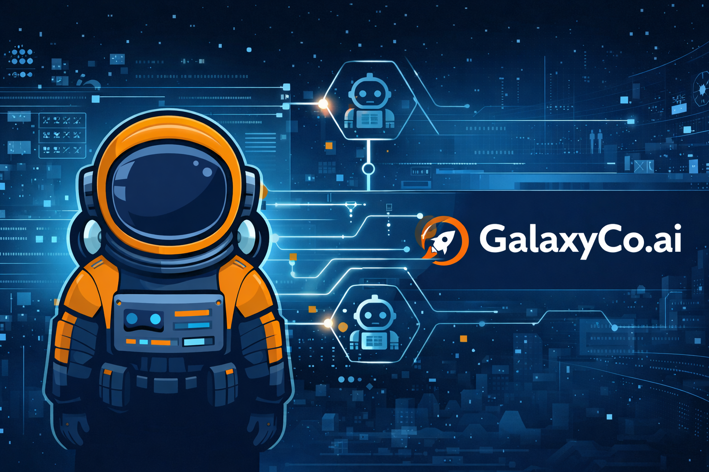

# GalaxyCo.ai - AI-Native Business Platform

[](https://github.com/galaxy-co-ai/galaxyco_ai_3.0/actions/workflows/ci.yml)
[](https://www.typescriptlang.org/)
[](https://nextjs.org/)
[](https://react.dev/)
[](https://tailwindcss.com/)
[](LICENSE)

An intelligent business automation platform combining AI agents, CRM, workflow automation, and knowledge management.

> Working with an AI coding agent? Start with `AGENTS.md`.

## Overview

GalaxyCo.ai is a comprehensive business platform that leverages AI to automate operations, manage customer relationships, and streamline workflows. Built for teams who want enterprise-grade features with modern developer experience.

### Neptune AI Assistant

**Neptune** is GalaxyCo's autonomous AI assistant that acts as your business copilot. Unlike traditional chatbots, Neptune:

- **Learns Your Style** - Adapts to how you communicate (casual/formal, concise/detailed)
- **Remembers Context** - Tracks entities, facts, and conversation flow within sessions
- **Takes Initiative** - Proactively suggests next steps before you ask
- **Auto-Executes** - Runs safe actions automatically, learns when to ask for confirmation
- **Chains Actions** - Orchestrates multi-step workflows (create lead → schedule meeting → create agenda)

**Completion Status:** ✅ **Phase 2 Complete** (Week 2 - Proactive Intelligence & Learning)  
**Latest:** ✅ **Phase 3 Complete** (Week 3 - Optimization & Polish)

📚 **Full Capabilities:** See [docs/guides/NEPTUNE_CAPABILITIES.md](./docs/guides/NEPTUNE_CAPABILITIES.md)  
🔧 **Troubleshooting:** See [docs/guides/NEPTUNE_TROUBLESHOOTING.md](./docs/guides/NEPTUNE_TROUBLESHOOTING.md)

## Features

### 🧠 Neptune AI Assistant (NEW)

- **Adaptive Communication** - Mirrors your communication style automatically
- **Session Memory** - Remembers context within conversations for natural follow-ups
- **Proactive Suggestions** - Detects patterns and suggests relevant actions
- **Smart Autonomy** - Learns when to auto-execute vs ask for confirmation
- **Tool Orchestration** - Chains actions together intelligently
- **Performance**: Sub-3-second responses, 70%+ auto-execution rate

### Core Capabilities

- 🤖 **AI Agents** - Autonomous agents for sales, marketing, support, and operations
- 👥 **CRM** - Complete customer relationship management with pipeline tracking
- 📅 **Calendar Integration** - Google Calendar and Microsoft Outlook sync
- 📞 **Communications** - SMS, voice, and messaging workflows via SignalWire
- 📚 **Knowledge Base** - RAG-powered document search and management
- 🎯 **Marketing Automation** - Campaign management, analytics, and optimization
- 💰 **Finance Integration** - QuickBooks, Stripe, and Shopify connectors
- 📊 **Analytics** - Real-time business intelligence and reporting
- 🎨 **Content Studio** - AI-assisted blog post and document creation

## Tech Stack

### Core

- **Framework**: Next.js 16 (App Router)
- **Language**: TypeScript
- **Database**: PostgreSQL (Neon)
- **ORM**: Drizzle
- **Auth**: Clerk

### Frontend

- **Styling**: Tailwind CSS
- **Components**: Radix UI
- **Icons**: Lucide
- **Forms**: React Hook Form + Zod

### AI & ML

- **LLM**: OpenAI GPT-4, Anthropic Claude
- **Embeddings**: OpenAI text-embedding-3-small
- **Vector DB**: Upstash Vector
- **Search**: Perplexity AI

### Infrastructure

- **Hosting**: Vercel
- **Storage**: Vercel Blob
- **Background Jobs**: Trigger.dev
- **Real-time**: Pusher
- **Monitoring**: Sentry

## Getting Started

For the canonical onboarding guide, see `docs/START.md`.

### Prerequisites

- Node.js 18+
- PostgreSQL database (Neon recommended)
- API keys for required services (see `.env.example`)

### Installation

```bash
# Clone the repository
git clone https://github.com/galaxy-co-ai/galaxyco_ai_3.0.git
cd galaxyco_ai_3.0

# Install dependencies
npm install

# Set up environment variables
cp .env.example .env.local
# Edit .env.local with your API keys

# Push database schema
npm run db:push

# Start development server
npm run dev
```

Visit [http://localhost:3000](http://localhost:3000) to see your app.

### Environment Variables

Key environment variables required:

- `DATABASE_URL` - PostgreSQL connection string
- `CLERK_SECRET_KEY` - Clerk authentication
- `OPENAI_API_KEY` - OpenAI API access
- `UPSTASH_REDIS_REST_URL` - Redis cache
- `UPSTASH_VECTOR_REST_URL` - Vector database

See `.env.example` for complete list.

MCP (ChatGPT integration) is experimental and disabled by default. Set `MCP_ENABLED=true` to enable it locally.

## Development

```bash
# Start dev server
npm run dev

# Open database GUI
npm run db:studio

# Run type checking
npm run typecheck

# Run linting
npm run lint

# Run tests
npm test
```

## Deployment

This application is optimized for deployment on Vercel:

1. Push your code to GitHub
2. Import project in Vercel
3. Configure environment variables
4. Deploy

For production deployment checklist, see `docs/guides/PRODUCTION_DEPLOYMENT_CHECKLIST.md`.

## Project Structure

```
├── src/
│   ├── app/              # Next.js app router
│   ├── components/       # React components
│   ├── lib/              # Utility functions
│   ├── db/               # Database schema
│   └── trigger/          # Background jobs
├── public/               # Static assets
└── drizzle/             # Database migrations
```

## Contributing

We welcome contributions! Please see our [Contributing Guidelines](CONTRIBUTING.md) for details on:

- Setting up your development environment
- Coding standards and conventions
- Testing requirements
- Pull request process

For security issues, please see [SECURITY.md](SECURITY.md).

## License

This project is proprietary software. All rights reserved. See `LICENSE`.

## Support

For questions or issues, contact: [hello@galaxyco.ai](mailto:hello@galaxyco.ai)
