# API Routes Map

**Generated:** 2025-12-13  
**Source:** `src/app/api/`  
**Total Routes:** 205+ endpoints

---

## API Structure Overview

```
/api
├── /admin          → Content management, analytics, settings
├── /agents         → Agent CRUD, test runs
├── /analytics      → Event tracking
├── /assistant      → Neptune AI chat, voice, insights
├── /auth           → OAuth flows
├── /calendar       → Events
├── /campaigns      → Marketing campaigns
├── /communications → SMS/calls
├── /contact        → Public contact form
├── /conversations  → Chat/messaging
├── /creator        → Document studio
├── /crm            → Contacts, deals, analytics
├── /dashboard      → Stats, roadmap
├── /feedback       → Platform feedback
├── /finance        → Invoices, expenses, reports
├── /integrations   → Third-party connections
├── /knowledge      → Document storage, search
├── /launchpad      → Blog/learning
├── /marketing      → Channels
├── /neptune        → AI conversation
├── /orchestration  → Teams, workflows, approvals
├── /public         → Public-facing endpoints
├── /pusher         → Realtime auth
├── /search         → Global search
├── /settings       → User/workspace config
├── /social         → Social media
├── /stripe         → Billing
├── /system         → Status, debug
├── /team           → Internal messaging
├── /webhooks       → Inbound webhooks
├── /workflows      → Galaxy Grids
└── /workspaces     → Workspace management
```

---

## Route Tree Diagram

```mermaid
flowchart LR
    subgraph Core["🏠 Core"]
        AUTH["/auth/oauth/[provider]"]
        DASH["/dashboard"]
        SEARCH["/search"]
        SETTINGS["/settings/*"]
    end

    subgraph CRM["👥 CRM"]
        CONTACTS["/crm/contacts"]
        DEALS["/crm/deals"]
        ANALYTICS_CRM["/crm/analytics"]
        SCORING["/crm/scoring-rules"]
        ROUTING["/crm/routing-rules"]
    end

    subgraph AI["🤖 AI/Neptune"]
        CHAT["/assistant/chat"]
        STREAM["/assistant/stream"]
        INSIGHTS["/assistant/insights"]
        VOICE["/assistant/voice/*"]
    end

    subgraph Orchestration["⚙️ Orchestration"]
        TEAMS["/orchestration/teams"]
        WORKFLOWS_ORCH["/orchestration/workflows"]
        APPROVALS["/orchestration/approvals"]
        MEMORY["/orchestration/memory"]
    end

    subgraph Content["📝 Content"]
        POSTS["/admin/posts"]
        TOPICS["/admin/topics"]
        SOURCES["/admin/sources"]
        USE_CASES["/admin/use-cases"]
    end

    subgraph Finance["💰 Finance"]
        INVOICES["/finance/invoices"]
        EXPENSES["/finance/expenses"]
        REVENUE["/finance/revenue"]
        CASHFLOW["/finance/cashflow"]
    end
```



---

## Detailed Route Reference

### 🏠 CORE / AUTH / SETTINGS

| Method | Endpoint | Description |
|--------|----------|-------------|
| GET/POST | `/api/auth/oauth/[provider]/route` | OAuth callback handlers |
| GET | `/api/dashboard` | Dashboard stats & metrics |
| GET | `/api/dashboard/v2` | Enhanced dashboard data |
| GET | `/api/dashboard/roadmap` | Product roadmap |
| GET | `/api/dashboard/welcome` | Welcome message |
| GET | `/api/search` | Global multi-entity search |
| GET | `/api/system/status` | System health check |

**Settings:**
| Method | Endpoint | Description |
|--------|----------|-------------|
| GET/PUT | `/api/settings/profile` | User profile |
| GET/PUT | `/api/settings/appearance` | Theme/UI preferences |
| GET/PUT | `/api/settings/notifications` | Notification preferences |
| GET/POST | `/api/settings/api-keys` | API key management |
| DELETE | `/api/settings/api-keys/[id]` | Delete API key |
| GET/POST | `/api/settings/webhooks` | Webhook configuration |
| PUT/DELETE | `/api/settings/webhooks/[id]` | Update/delete webhook |
| GET/PUT | `/api/settings/workspace` | Workspace settings |
| GET/POST | `/api/settings/team` | Team members |
| DELETE | `/api/settings/team/[id]` | Remove team member |
| GET/PUT | `/api/settings/billing` | Billing info |

---

### 👥 CRM

| Method | Endpoint | Description |
|--------|----------|-------------|
| GET | `/api/crm` | CRM overview |
| GET/POST | `/api/crm/contacts` | List/create contacts |
| GET/PUT/DELETE | `/api/crm/contacts/[id]` | Contact CRUD |
| POST | `/api/crm/contacts/import` | Bulk import (CSV) |
| GET | `/api/crm/contacts/export` | Export contacts |
| GET/POST | `/api/crm/deals` | List/create deals |
| GET/PUT/DELETE/PATCH | `/api/crm/deals/[id]` | Deal CRUD + stage update |
| GET/POST | `/api/crm/customers` | List/create customers |
| GET/PUT/DELETE | `/api/crm/customers/[id]` | Customer CRUD |
| GET/POST | `/api/crm/prospects` | List/create prospects |
| GET/PUT/DELETE | `/api/crm/prospects/[id]` | Prospect CRUD |
| GET/POST | `/api/crm/projects` | List/create projects |
| GET | `/api/crm/analytics` | CRM analytics + trends |
| GET | `/api/crm/insights` | AI-powered insights |
| GET | `/api/crm/reports/revenue` | Revenue reports |
| POST | `/api/crm/score` | Calculate lead score |
| GET/POST | `/api/crm/scoring-rules` | Lead scoring rules |
| PUT/DELETE | `/api/crm/scoring-rules/[id]` | Update/delete rule |
| GET/POST | `/api/crm/routing-rules` | Lead routing rules |
| PUT/DELETE | `/api/crm/routing-rules/[id]` | Update/delete rule |

---

### 🤖 AI / NEPTUNE ASSISTANT

| Method | Endpoint | Description |
|--------|----------|-------------|
| POST | `/api/assistant/chat` | Main chat endpoint |
| POST | `/api/assistant/stream` | Streaming chat |
| POST | `/api/assistant/simple` | Simple completion |
| GET | `/api/assistant/greeting` | Dynamic greeting |
| GET | `/api/assistant/briefing` | Daily briefing |
| GET | `/api/assistant/insights` | Proactive insights |
| GET/POST | `/api/assistant/conversations` | Conversation history |
| GET/DELETE | `/api/assistant/conversations/[id]` | Single conversation |
| POST | `/api/assistant/feedback` | Message feedback |
| GET/PUT | `/api/assistant/preferences` | User AI preferences |
| POST | `/api/assistant/upload` | File upload for context |
| POST | `/api/assistant/analyze-website` | Website analysis |
| POST | `/api/assistant/action-approval` | Approve AI action |
| POST | `/api/assistant/voice/speak` | Text-to-speech |
| POST | `/api/assistant/voice/transcribe` | Speech-to-text |
| POST | `/api/neptune/conversation` | Neptune conversation |

---

### ⚙️ ORCHESTRATION

| Method | Endpoint | Description |
|--------|----------|-------------|
| GET/POST | `/api/orchestration/teams` | List/create teams |
| GET/PUT/DELETE | `/api/orchestration/teams/[id]` | Team CRUD |
| GET/POST | `/api/orchestration/workflows` | List/create workflows |
| GET/PUT/DELETE | `/api/orchestration/workflows/[id]` | Workflow CRUD |
| POST | `/api/orchestration/workflows/[id]/execute` | Execute workflow |
| GET | `/api/orchestration/workflows/executions` | Execution history |
| GET/POST | `/api/orchestration/approvals` | Pending approvals |
| POST | `/api/orchestration/approvals/[id]` | Approve/reject |
| POST | `/api/orchestration/approvals/bulk` | Bulk approve/reject |
| GET | `/api/orchestration/audit` | Audit log |
| GET | `/api/orchestration/audit/[teamId]` | Team audit log |
| GET/POST | `/api/orchestration/memory` | Shared memory |
| GET/POST | `/api/orchestration/messages` | Agent messages |
| POST | `/api/orchestration/delegate` | Delegate to agent |
| POST | `/api/orchestration/route` | Route task to team |
| GET | `/api/orchestration/metrics` | Orchestration metrics |

---

### 🤖 AGENTS

| Method | Endpoint | Description |
|--------|----------|-------------|
| GET/POST | `/api/agents` | List/create agents |
| GET/PUT/DELETE | `/api/agents/[id]` | Agent CRUD |
| POST | `/api/agents/[id]/run` | Execute agent |
| POST | `/api/agents/[id]/chat` | Agent chat |
| POST | `/api/agents/test-run` | Test agent config |
| GET | `/api/agent-templates` | Marketplace templates |

---


### 📝 ADMIN / CONTENT

| Method | Endpoint | Description |
|--------|----------|-------------|
| GET/POST | `/api/admin/posts` | Blog posts |
| GET/PUT/DELETE | `/api/admin/posts/[id]` | Post CRUD |
| GET/POST | `/api/admin/categories` | Categories |
| PUT/DELETE | `/api/admin/categories/[id]` | Category CRUD |
| GET/POST | `/api/admin/topics` | Topic ideas |
| PUT/DELETE | `/api/admin/topics/[id]` | Topic CRUD |
| GET/POST | `/api/admin/sources` | Article sources |
| PUT/DELETE | `/api/admin/sources/[id]` | Source CRUD |
| GET/POST | `/api/admin/content-sources` | Content sources |
| PUT/DELETE | `/api/admin/content-sources/[id]` | Source CRUD |
| GET | `/api/admin/content-sources/suggestions` | AI suggestions |
| GET/POST | `/api/admin/use-cases` | Use case profiles |
| GET/PUT/DELETE | `/api/admin/use-cases/[id]` | Use case CRUD |
| POST | `/api/admin/use-cases/match` | Match use case |
| GET/POST | `/api/admin/hit-list` | Hit list items |
| PUT/DELETE | `/api/admin/hit-list/[id]` | Hit list CRUD |
| POST | `/api/admin/hit-list/reorder` | Reorder items |
| GET/POST | `/api/admin/alert-badges` | Alert badges |
| PUT/DELETE | `/api/admin/alert-badges/[id]` | Badge CRUD |
| POST | `/api/admin/alert-badges/bulk-dismiss` | Bulk dismiss |
| GET | `/api/admin/metrics` | Admin metrics |
| GET | `/api/admin/metrics/health` | Health metrics |
| GET | `/api/admin/metrics/neptune` | Neptune metrics |

**AI Content Generation:**
| Method | Endpoint | Description |
|--------|----------|-------------|
| POST | `/api/admin/ai/topics` | Generate topics |
| POST | `/api/admin/ai/brainstorm` | Brainstorm mode |
| POST | `/api/admin/ai/outline` | Generate outline |
| POST | `/api/admin/ai/continue` | Continue writing |
| POST | `/api/admin/ai/rewrite` | Rewrite content |
| POST | `/api/admin/ai/seo` | SEO optimization |
| POST | `/api/admin/ai/source` | Verify source |
| POST | `/api/admin/ai/sources` | Find sources |
| POST | `/api/admin/ai/image` | Generate image |
| POST | `/api/admin/ai/hit-list` | Hit list AI |

**Blog Profile:**
| Method | Endpoint | Description |
|--------|----------|-------------|
| GET/PUT | `/api/admin/blog-profile` | Voice profile |
| POST | `/api/admin/blog-profile/analyze` | Analyze writing |
| POST | `/api/admin/upload/image` | Upload image |

**Analytics:**
| Method | Endpoint | Description |
|--------|----------|-------------|
| GET | `/api/admin/analytics/overview` | Overview stats |
| GET | `/api/admin/analytics/articles` | Article performance |
| GET | `/api/admin/analytics/trends` | Content trends |

**Feedback:**
| Method | Endpoint | Description |
|--------|----------|-------------|
| GET | `/api/admin/feedback` | All feedback |
| PUT | `/api/admin/feedback/[id]` | Update feedback |

**To-Do HQ:**
| Method | Endpoint | Description |
|--------|----------|-------------|
| GET/POST | `/api/admin/todo-hq/sprints` | Sprints |
| GET/POST | `/api/admin/todo-hq/epics` | Epics |
| GET/POST | `/api/admin/todo-hq/tasks` | Tasks |
| POST | `/api/admin/todo-hq/bootstrap` | Bootstrap template |
| POST | `/api/admin/todo-hq/clear` | Clear all |

---

### 💰 FINANCE

| Method | Endpoint | Description |
|--------|----------|-------------|
| GET | `/api/finance/overview` | Financial overview |
| GET | `/api/finance/revenue` | Revenue tracking |
| GET | `/api/finance/cashflow` | Cash flow forecast |
| GET | `/api/finance/activity` | Recent activity |
| GET | `/api/finance/timeline` | Financial timeline |
| GET | `/api/finance/modules` | Finance modules |
| GET/POST | `/api/finance/invoices` | Invoices |
| GET/PUT/DELETE | `/api/finance/invoices/[id]` | Invoice CRUD |
| GET/POST | `/api/finance/expenses` | Expenses |
| GET/PUT/DELETE | `/api/finance/expenses/[id]` | Expense CRUD |
| GET | `/api/finance/integrations` | Finance integrations |

---

### 📚 KNOWLEDGE BASE

| Method | Endpoint | Description |
|--------|----------|-------------|
| GET/POST | `/api/knowledge` | List/create items |
| GET/PUT/DELETE | `/api/knowledge/[id]` | Item CRUD |
| POST | `/api/knowledge/upload` | Upload document |
| GET | `/api/knowledge/search` | Semantic search |

---

### 🎨 CREATOR STUDIO

| Method | Endpoint | Description |
|--------|----------|-------------|
| GET/POST | `/api/creator/items` | List/create items |
| GET/PUT/DELETE | `/api/creator/items/[id]` | Item CRUD |
| GET/POST | `/api/creator/collections` | Collections |
| GET/PUT/DELETE | `/api/creator/collections/[id]` | Collection CRUD |
| GET/POST | `/api/creator/templates` | Templates |
| GET/PUT/DELETE | `/api/creator/templates/[id]` | Template CRUD |
| POST | `/api/creator/generate` | AI generate content |
| POST | `/api/creator/ai-edit` | AI edit content |
| POST | `/api/creator/gamma` | Gamma integration |
| POST | `/api/creator/share` | Create share link |
| GET | `/api/creator/share/[token]` | Access shared doc |
| GET | `/api/creator/stats` | Creator stats |

---

### 📊 MARKETING

| Method | Endpoint | Description |
|--------|----------|-------------|
| GET/POST | `/api/marketing/channels` | Marketing channels |
| PUT/DELETE | `/api/marketing/channels/[id]` | Channel CRUD |
| GET/POST | `/api/campaigns` | Campaigns |
| GET/PUT/DELETE | `/api/campaigns/[id]` | Campaign CRUD |
| POST | `/api/campaigns/[id]/send` | Send campaign |

---

### 💬 CONVERSATIONS / COMMUNICATIONS

| Method | Endpoint | Description |
|--------|----------|-------------|
| GET/POST | `/api/conversations` | Conversations |
| GET/PUT/DELETE | `/api/conversations/[id]` | Conversation CRUD |
| GET/POST | `/api/conversations/[id]/messages` | Messages |
| POST | `/api/conversations/neptune/action` | Neptune action |
| GET/POST | `/api/communications` | Communications |
| GET/PUT/DELETE | `/api/communications/[id]` | Communication CRUD |
| GET | `/api/communications/status` | Delivery status |
| GET/POST | `/api/team/channels` | Team channels |
| GET/PUT/DELETE | `/api/team/channels/[id]` | Channel CRUD |
| POST | `/api/team/upload` | Team file upload |

---

### 📅 CALENDAR

| Method | Endpoint | Description |
|--------|----------|-------------|
| GET/POST | `/api/calendar/events` | Calendar events |

---

### 🔗 INTEGRATIONS

| Method | Endpoint | Description |
|--------|----------|-------------|
| GET | `/api/integrations/status` | All integration status |
| GET/PUT | `/api/integrations/[id]` | Integration details |

---

### 📰 LAUNCHPAD / BLOG

| Method | Endpoint | Description |
|--------|----------|-------------|
| GET | `/api/launchpad/posts` | Public blog posts |
| POST | `/api/launchpad/engagement` | Track engagement |

---

### 🔔 WEBHOOKS (Inbound)

| Method | Endpoint | Description |
|--------|----------|-------------|
| POST | `/api/webhooks/clerk` | Clerk auth events |
| POST | `/api/webhooks/stripe` | Stripe payment events |
| POST | `/api/webhooks/signalwire` | SignalWire SMS/voice |
| POST | `/api/webhooks/twilio` | Twilio fallback |
| POST | `/api/webhooks/twilio/status` | Twilio status |
| POST | `/api/webhooks/email` | Inbound email |

---

### 💳 BILLING (Stripe)

| Method | Endpoint | Description |
|--------|----------|-------------|
| POST | `/api/stripe/checkout` | Create checkout session |
| POST | `/api/stripe/portal` | Customer portal |

---

### 📊 ANALYTICS

| Method | Endpoint | Description |
|--------|----------|-------------|
| POST | `/api/analytics/events` | Log event |
| POST | `/api/analytics/track` | Track pageview |

---

### 🔄 WORKFLOWS (Galaxy Grids)

| Method | Endpoint | Description |
|--------|----------|-------------|
| GET/POST | `/api/workflows` | List/create workflows |
| GET/PUT/DELETE | `/api/workflows/[id]` | Workflow CRUD |
| POST | `/api/workflows/[id]/execute` | Execute workflow |

---

### 🏢 WORKSPACES

| Method | Endpoint | Description |
|--------|----------|-------------|
| GET/PUT | `/api/workspaces/[id]` | Workspace details |
| GET/POST | `/api/workspaces/[id]/phone-numbers` | Phone numbers |

---

### 📱 SOCIAL MEDIA

| Method | Endpoint | Description |
|--------|----------|-------------|
| GET/POST | `/api/social/accounts` | Social accounts |
| GET/POST | `/api/social/posts` | Social posts |

---

### 🔧 MISC

| Method | Endpoint | Description |
|--------|----------|-------------|
| GET | `/api/activity` | Activity feed |
| POST | `/api/contact` | Public contact form |
| POST | `/api/feedback` | Quick feedback |
| GET | `/api/link-preview` | URL preview |
| POST | `/api/newsletter/subscribe` | Newsletter signup |
| POST | `/api/public/chat` | Public chat widget |
| POST | `/api/pusher/auth` | Pusher auth |

---

## Authentication Notes

- Most routes require Clerk authentication
- Public routes: `/api/public/*`, `/api/contact`, `/api/newsletter/*`, `/api/launchpad/*`
- Webhook routes verify signatures (HMAC)
- All authenticated routes enforce workspace isolation via `workspaceId`

---

*Generated from API route scan — update when adding new endpoints.*
