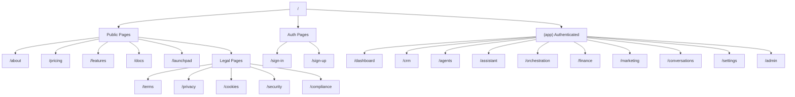

# Frontend Routes Map

**Generated:** 2025-12-13  
**Source:** `src/app/`  
**Architecture:** Next.js 14 App Router

---

## Route Structure Overview

```
src/app/
├── (app)/           → Authenticated app routes (with layout)
├── about/           → Public about page
├── api/             → API routes (see 02-API-ROUTES.md)
├── compliance/      → Compliance info
├── contact/         → Contact page
├── cookies/         → Cookie policy
├── docs/            → Documentation
├── features/        → Features marketing
├── launchpad/       → Public blog/learning
├── pricing/         → Pricing page
├── privacy/         → Privacy policy
├── security/        → Security info
├── shared/          → Shared document viewer
├── sign-in/         → Clerk sign-in
├── sign-up/         → Clerk sign-up
├── terms/           → Terms of service
├── layout.tsx       → Root layout
└── page.tsx         → Landing page (/)
```

---

## Route Tree Diagram



---

## Detailed Route Reference

### 🌐 PUBLIC PAGES (No Auth Required)

| Route | Page | Description |
|-------|------|-------------|
| `/` | `page.tsx` | Landing page / Marketing homepage |
| `/about` | `about/page.tsx` | About GalaxyCo.ai |
| `/pricing` | `pricing/page.tsx` | Pricing plans |
| `/features` | `features/page.tsx` | Feature showcase |
| `/docs` | `docs/page.tsx` | Documentation |
| `/contact` | `contact/page.tsx` | Contact form |
| `/terms` | `terms/page.tsx` | Terms of Service |
| `/privacy` | `privacy/page.tsx` | Privacy Policy |
| `/cookies` | `cookies/page.tsx` | Cookie Policy |
| `/security` | `security/page.tsx` | Security info |
| `/compliance` | `compliance/page.tsx` | Compliance info |

### 📰 LAUNCHPAD (Public Blog/Learning)

| Route | Page | Description |
|-------|------|-------------|
| `/launchpad` | `launchpad/page.tsx` | Blog/learning hub |

### 🔗 SHARED DOCUMENTS

| Route | Page | Description |
|-------|------|-------------|
| `/shared/[token]` | `shared/[token]/page.tsx` | Public shared document |

---

## 🔒 AUTHENTICATED ROUTES (`/app/*`)

All routes under `(app)/` require authentication via Clerk.

### 📊 DASHBOARD

| Route | Page | Description |
|-------|------|-------------|
| `/dashboard` | `(app)/dashboard/page.tsx` | Main dashboard with stats, activity, agents |

### 👥 CRM

| Route | Page | Description |
|-------|------|-------------|
| `/crm` | `(app)/crm/page.tsx` | CRM dashboard (contacts, deals, pipeline) |

### 🤖 AGENTS

| Route | Page | Description |
|-------|------|-------------|
| `/agents` | `(app)/agents/` | My Agents dashboard |

### 💬 ASSISTANT (Neptune)

| Route | Page | Description |
|-------|------|-------------|
| `/assistant` | `(app)/assistant/page.tsx` | Neptune AI chat interface |

### ⚙️ ORCHESTRATION

| Route | Page | Description |
|-------|------|-------------|
| `/orchestration` | `(app)/orchestration/page.tsx` | Orchestration dashboard |
| `/orchestration/teams` | `(app)/orchestration/teams/page.tsx` | Agent teams list |
| `/orchestration/teams/[id]` | `(app)/orchestration/teams/[id]/page.tsx` | Team details |
| `/orchestration/workflows` | `(app)/orchestration/workflows/page.tsx` | Workflows list |
| `/orchestration/workflows/[id]` | `(app)/orchestration/workflows/[id]/page.tsx` | Workflow editor |
| `/orchestration/approvals` | `(app)/orchestration/approvals/page.tsx` | Approval queue |

### 💬 CONVERSATIONS

| Route | Page | Description |
|-------|------|-------------|
| `/conversations` | `(app)/conversations/page.tsx` | Unified inbox |

### 📈 MARKETING

| Route | Page | Description |
|-------|------|-------------|
| `/marketing` | `(app)/marketing/page.tsx` | Marketing dashboard |

### 💰 FINANCE

| Route | Page | Description |
|-------|------|-------------|
| `/finance` | `(app)/finance/page.tsx` | Finance dashboard |
| `/finance/expenses` | `(app)/finance/expenses/page.tsx` | Expense tracking |
| `/finance-hq` | `(app)/finance-hq/` | Finance HQ (advanced) |

### 📚 KNOWLEDGE / LIBRARY

| Route | Page | Description |
|-------|------|-------------|
| `/knowledge` | `(app)/knowledge/` | Knowledge base |
| `/knowledge-base` | `(app)/knowledge-base/` | Document library |
| `/library` | `(app)/library/page.tsx` | Library view |

### 🎨 CREATOR STUDIO

| Route | Page | Description |
|-------|------|-------------|
| `/creator` | `(app)/creator/page.tsx` | Document creation studio |

### 🔗 INTEGRATIONS

| Route | Page | Description |
|-------|------|-------------|
| `/connected-apps` | `(app)/connected-apps/page.tsx` | Third-party integrations |

### 📖 ACTIVITY

| Route | Page | Description |
|-------|------|-------------|
| `/activity` | `(app)/activity/page.tsx` | Activity feed |

### 🚀 ONBOARDING

| Route | Page | Description |
|-------|------|-------------|
| `/onboarding` | `(app)/onboarding/page.tsx` | New user onboarding wizard |

### 🌙 LUNAR LABS

| Route | Page | Description |
|-------|------|-------------|
| `/lunar-labs` | `(app)/lunar-labs/page.tsx` | Experimental features |

### ⚙️ SETTINGS

| Route | Page | Description |
|-------|------|-------------|
| `/settings` | `(app)/settings/page.tsx` | Main settings page |
| `/settings/phone-numbers` | `(app)/settings/phone-numbers/page.tsx` | Phone number management |

---

## 👤 ADMIN ROUTES (`/admin/*`)

Admin-only routes for platform management.

| Route | Page | Description |
|-------|------|-------------|
| `/admin` | `(app)/admin/page.tsx` | Admin dashboard |
| `/admin/users` | `(app)/admin/users/page.tsx` | User management |
| `/admin/analytics` | `(app)/admin/analytics/page.tsx` | Platform analytics |
| `/admin/feedback` | `(app)/admin/feedback/page.tsx` | User feedback |
| `/admin/settings` | `(app)/admin/settings/page.tsx` | Admin settings |
| `/admin/settings/voice-profile` | `(app)/admin/settings/voice-profile/page.tsx` | Voice profile config |
| `/admin/todo-hq` | `(app)/admin/todo-hq/page.tsx` | To-Do HQ (task management) |

### 📝 CONTENT MANAGEMENT (`/admin/content/*`)

| Route | Page | Description |
|-------|------|-------------|
| `/admin/content` | `(app)/admin/content/page.tsx` | Content dashboard |
| `/admin/content/posts` | `(app)/admin/content/posts/page.tsx` | Blog posts |
| `/admin/content/posts/[id]` | `(app)/admin/content/posts/[id]/page.tsx` | Post editor |
| `/admin/content/new` | `(app)/admin/content/new/page.tsx` | New post |
| `/admin/content/categories` | `(app)/admin/content/categories/page.tsx` | Categories |
| `/admin/content/hit-list` | `(app)/admin/content/hit-list/page.tsx` | Content hit list |
| `/admin/content/sources` | `(app)/admin/content/sources/page.tsx` | Content sources |
| `/admin/content/use-cases` | `(app)/admin/content/use-cases/page.tsx` | Use case profiles |
| `/admin/content/article-studio` | `(app)/admin/content/article-studio/page.tsx` | Article Studio |
| `/admin/content/analytics` | `(app)/admin/content/analytics/page.tsx` | Content analytics |

---

## Route Grouping Notes

### Route Groups (Parentheses)
- `(app)` - Groups authenticated routes with shared layout
- Does NOT appear in URL

### Dynamic Routes
- `[id]` - Dynamic parameter (e.g., `/crm/contacts/123`)
- `[token]` - Token-based access (e.g., `/shared/abc123`)

### Loading States
Files like `loading.tsx` provide skeleton UI during navigation:
- `/dashboard/loading.tsx`
- `/crm/loading.tsx`
- `/marketing/loading.tsx`
- `/agents/loading.tsx`
- `/conversations/loading.tsx`
- `/knowledge/loading.tsx`
- `/finance-hq/loading.tsx`

### Error Boundaries
- `(app)/error.tsx` - App-level error boundary
- `global-error.tsx` - Root error handler

---

## Layout Hierarchy

```
layout.tsx (root)
└── (app)/layout.tsx (authenticated wrapper)
    ├── Sidebar navigation
    ├── Header with search
    ├── Neptune assistant trigger
    └── All authenticated pages
```

---

*Generated from route scan — update when adding new pages.*
