# Component Architecture Map

**Generated:** 2025-12-13  
**Source:** `src/components/`  
**Total Components:** 293+

---

## Component Organization

```
src/components/
├── ui/              → Base primitives (Button, Input, Dialog, etc.)
├── shared/          → Cross-feature utilities (Search, Navigation, etc.)
├── mobile/          → Mobile-specific components
├── landing/         → Marketing/public pages
│
├── dashboard/       → Dashboard widgets & cards
├── crm/             → CRM feature components
├── agents/          → Agent management
├── orchestration/   → Teams, workflows, approvals
├── conversations/   → Messaging UI
├── finance-hq/      → Finance features
├── marketing/       → Marketing dashboards
├── knowledge-base/  → Document management
├── creator/         → Creator studio
├── launchpad/       → Blog/learning
├── neptune/         → AI assistant UI
├── assistant/       → Assistant chat interface
├── settings/        → Settings panels
├── admin/           → Admin panels
├── integrations/    → Integration cards
├── activity/        → Activity feed
│
├── galaxy/          → Galaxy branding/theming
├── lunar-labs/      → Experimental features
├── figma/           → Figma-exported components
└── _archive/        → Deprecated components
```

---

## Component Hierarchy Diagram

```mermaid
flowchart TD
    subgraph Primitives["🧱 UI Primitives (shadcn/ui)"]
        BUTTON[Button]
        INPUT[Input]
        DIALOG[Dialog]
        CARD[Card]
        TABLE[Table]
        DROPDOWN[DropdownMenu]
        TABS[Tabs]
        SHEET[Sheet]
        TOAST[Toast]
    end

    subgraph Shared["🔗 Shared Components"]
        SEARCH[GlobalSearch]
        NAV[Sidebar]
        CMD[CommandPalette]
        NOTIF[NotificationCenter]
        MOBILE_NAV[MobileNavigation]
    end

    subgraph Features["📦 Feature Components"]
        DASH[Dashboard/*]
        CRM_COMP[CRM/*]
        AGENTS_COMP[Agents/*]
        ORCH[Orchestration/*]
        CONV[Conversations/*]
        FIN[Finance/*]
    end

    Primitives --> Shared
    Shared --> Features
```



---

## Detailed Component Reference

### 🧱 UI PRIMITIVES (`/ui/`)

Base components from shadcn/ui + custom extensions.

| Component | File | Description |
|-----------|------|-------------|
| Button | `button.tsx` | Primary button component |
| Input | `input.tsx` | Text input |
| Textarea | `textarea.tsx` | Multi-line input |
| Select | `select.tsx` | Dropdown select |
| Checkbox | `checkbox.tsx` | Checkbox input |
| Switch | `switch.tsx` | Toggle switch |
| Radio | `radio-group.tsx` | Radio buttons |
| Label | `label.tsx` | Form labels |
| Form | `form.tsx` | Form wrapper (react-hook-form) |
| Dialog | `dialog.tsx` | Modal dialog |
| Sheet | `sheet.tsx` | Slide-out panel |
| Drawer | `drawer.tsx` | Bottom drawer |
| Card | `card.tsx` | Content card |
| Table | `table.tsx` | Data table |
| DataTable | `data-table.tsx` | Enhanced data table |
| Tabs | `tabs.tsx` | Tab navigation |
| Dropdown | `dropdown-menu.tsx` | Dropdown menu |
| Context Menu | `context-menu.tsx` | Right-click menu |
| Command | `command.tsx` | Command palette base |
| Popover | `popover.tsx` | Floating content |
| Tooltip | `tooltip.tsx` | Hover tooltips |
| Alert | `alert.tsx` | Alert messages |
| Toast | `toast.tsx` | Toast notifications |
| Badge | `badge.tsx` | Status badges |
| Avatar | `avatar.tsx` | User avatars |
| Progress | `progress.tsx` | Progress bar |
| Skeleton | `skeleton.tsx` | Loading skeleton |
| Separator | `separator.tsx` | Visual divider |
| Scroll Area | `scroll-area.tsx` | Custom scrollbar |
| Calendar | `calendar.tsx` | Date picker |
| Slider | `slider.tsx` | Range slider |
| Collapsible | `collapsible.tsx` | Expand/collapse |
| Accordion | `accordion.tsx` | Accordion panels |
| NavigationMenu | `navigation-menu.tsx` | Nav menu |
| Breadcrumb | `breadcrumb.tsx` | Breadcrumb trail |
| Pagination | `pagination.tsx` | Page navigation |

---

### 🔗 SHARED COMPONENTS (`/shared/`)

Cross-feature utilities and layout components.

| Component | Description |
|-----------|-------------|
| `GlobalSearch.tsx` | Multi-entity search (Cmd+K) |
| `CommandPalette.tsx` | Command palette UI |
| `NotificationCenter.tsx` | Notification popover |
| `ToastProvider.tsx` | Toast notification system |
| `AppSidebar.tsx` | Main navigation sidebar |
| `Header.tsx` | App header with search |
| `MobileNavigation.tsx` | Mobile bottom nav |
| `MobileMenuDrawer.tsx` | Mobile menu |
| `SwipeableListItem.tsx` | Swipe actions |
| `PullToRefresh.tsx` | Pull-to-refresh |
| `ResponsiveTable.tsx` | Adaptive table/cards |
| `MobileDialog.tsx` | Bottom sheet on mobile |
| `LoadingSpinner.tsx` | Loading indicator |
| `EmptyState.tsx` | Empty state placeholder |
| `ErrorBoundary.tsx` | Error catching |
| `ConfirmDialog.tsx` | Confirmation modal |
| `DatePicker.tsx` | Date selection |
| `FileUpload.tsx` | File upload UI |
| `RichTextEditor.tsx` | Tiptap editor |
| `MarkdownRenderer.tsx` | Markdown display |
| `UserAvatar.tsx` | User profile avatar |
| `StatusBadge.tsx` | Status indicator |
| `MetricCard.tsx` | Stats card |
| `TrendIndicator.tsx` | Trend arrows |

---

### 📊 DASHBOARD (`/dashboard/`)

Dashboard widgets and visualizations.

| Component | Description |
|-----------|-------------|
| `DashboardLayout.tsx` | Dashboard grid layout |
| `StatsCard.tsx` | Statistics card with trends |
| `ActivityFeed.tsx` | Recent activity list |
| `QuickActionsBar.tsx` | Quick action buttons |
| `AgentStatusGrid.tsx` | Agent status overview |
| `WorkflowStatusCard.tsx` | Workflow status |
| `MiniChart.tsx` | Sparkline charts |
| `WelcomeCard.tsx` | Personalized welcome |
| `InsightsPanel.tsx` | AI insights |

---

### 👥 CRM (`/crm/`)

Customer relationship management.

| Component | Description |
|-----------|-------------|
| `CRMDashboard.tsx` | Main CRM view |
| `ContactsTable.tsx` | Contacts data table |
| `ContactCard.tsx` | Contact card view |
| `ContactDialog.tsx` | Create/edit contact |
| `ContactDetailView.tsx` | Contact full details |
| `DealsTable.tsx` | Deals list |
| `DealDialog.tsx` | Create/edit deal |
| `DealDetailView.tsx` | Deal full details |
| `SalesKanban.tsx` | Pipeline kanban (drag-drop) |
| `PipelineView.tsx` | Pipeline visualization |
| `InsightsTab.tsx` | CRM analytics |
| `ImportContactsDialog.tsx` | CSV import |
| `LeadScoringRulesDialog.tsx` | Scoring rules |
| `LeadRoutingRulesDialog.tsx` | Routing rules |
| `InteractionTimeline.tsx` | Activity timeline |

---

### 🤖 AGENTS (`/agents/`)

Agent management and configuration.

| Component | Description |
|-----------|-------------|
| `AgentsDashboard.tsx` | My Agents view |
| `AgentCard.tsx` | Agent card |
| `AgentConfigModal.tsx` | Agent configuration |
| `AgentTemplateCard.tsx` | Template marketplace card |
| `AgentTestRunner.tsx` | Test agent execution |
| `AgentStatusIndicator.tsx` | Status badge |
| `AgentMetrics.tsx` | Performance metrics |

---

### ⚙️ ORCHESTRATION (`/orchestration/`)

Multi-agent coordination.

| Component | Description |
|-----------|-------------|
| `OrchestrationDashboard.tsx` | Overview dashboard |
| `TeamsList.tsx` | Agent teams list |
| `TeamCard.tsx` | Team card |
| `TeamDetailView.tsx` | Team configuration |
| `TeamCreationWizard.tsx` | Create team wizard |
| `WorkflowsList.tsx` | Workflows list |
| `WorkflowBuilder.tsx` | Visual workflow editor |
| `WorkflowExecutionLog.tsx` | Execution history |
| `ApprovalQueue.tsx` | Pending approvals |
| `ApprovalCard.tsx` | Approval item |
| `MemoryViewer.tsx` | Shared memory browser |
| `MessageBus.tsx` | Agent messages |

---

### 💬 CONVERSATIONS (`/conversations/`)

Messaging and communication.

| Component | Description |
|-----------|-------------|
| `ConversationsList.tsx` | Conversation inbox |
| `ConversationView.tsx` | Single conversation |
| `MessageComposer.tsx` | Message input |
| `MessageBubble.tsx` | Message display |
| `ChannelSelector.tsx` | Channel picker |
| `ParticipantsList.tsx` | Participants |
| `ConversationFilters.tsx` | Filter controls |

---

### 💰 FINANCE (`/finance-hq/`)

Financial management.

| Component | Description |
|-----------|-------------|
| `FinanceDashboard.tsx` | Finance overview |
| `RevenueChart.tsx` | Revenue visualization |
| `CashFlowChart.tsx` | Cash flow forecast |
| `InvoicesList.tsx` | Invoices table |
| `InvoiceDialog.tsx` | Create/edit invoice |
| `ExpensesList.tsx` | Expenses table |
| `ExpenseDialog.tsx` | Create/edit expense |
| `IntegrationCards.tsx` | Finance integrations |
| `BudgetTracker.tsx` | Budget vs actual |

---

### 📈 MARKETING (`/marketing/`)

Marketing campaigns and analytics.

| Component | Description |
|-----------|-------------|
| `MarketingDashboard.tsx` | Marketing overview |
| `CampaignsList.tsx` | Campaigns table |
| `CampaignCard.tsx` | Campaign summary |
| `CampaignBuilder.tsx` | Campaign creation |
| `ChannelPerformance.tsx` | Channel metrics |
| `ROICalculator.tsx` | ROI analysis |

---

### 📚 KNOWLEDGE BASE (`/knowledge-base/`)

Document management.

| Component | Description |
|-----------|-------------|
| `KnowledgeGrid.tsx` | Document grid |
| `DocumentCard.tsx` | Document card |
| `FolderTree.tsx` | Folder navigation |
| `DocumentViewer.tsx` | Document preview |
| `UploadDialog.tsx` | File upload |
| `SearchResults.tsx` | Search results |

---

### 🎨 CREATOR STUDIO (`/creator/`)

Document creation.

| Component | Description |
|-----------|-------------|
| `CreatorWorkspace.tsx` | Main workspace |
| `DocumentEditor.tsx` | Rich text editor |
| `TemplateGallery.tsx` | Template picker |
| `ShareDialog.tsx` | Share settings |
| `AIAssist.tsx` | AI writing assist |

---

### 🤖 NEPTUNE / ASSISTANT (`/neptune/`, `/assistant/`)

AI assistant interface.

| Component | Description |
|-----------|-------------|
| `NeptuneChat.tsx` | Main chat interface |
| `ChatInput.tsx` | Message input |
| `ChatMessage.tsx` | Message display |
| `ActionCard.tsx` | AI action preview |
| `InsightCard.tsx` | Proactive insight |
| `VoiceInput.tsx` | Voice recording |
| `ContextPanel.tsx` | Context sidebar |

---


### ⚙️ SETTINGS (`/settings/`)

Settings panels and configuration.

| Component | Description |
|-----------|-------------|
| `SettingsLayout.tsx` | Settings page layout |
| `ProfileSettings.tsx` | User profile |
| `AppearanceSettings.tsx` | Theme/UI |
| `NotificationSettings.tsx` | Notification prefs |
| `ApiKeysSettings.tsx` | API key management |
| `WebhooksSettings.tsx` | Webhook config |
| `TeamSettings.tsx` | Team members |
| `WorkspaceSettings.tsx` | Workspace config |
| `BillingSettings.tsx` | Subscription/billing |
| `PhoneNumbersSettings.tsx` | Phone management |

---

### 👤 ADMIN (`/admin/`)

Admin-only components.

| Component | Description |
|-----------|-------------|
| `AdminDashboard.tsx` | Admin overview |
| `UsersList.tsx` | User management |
| `FeedbackList.tsx` | User feedback |
| `AnalyticsDashboard.tsx` | Platform analytics |
| `ContentDashboard.tsx` | Content management |
| `TodoHQ.tsx` | To-Do HQ interface |
| `EpicCard.tsx` | Epic card |
| `TaskCard.tsx` | Task card |
| `SprintSelector.tsx` | Sprint picker |
| `ArticleStudio.tsx` | Article creation |
| `HitList.tsx` | Content hit list |
| `UseCaseEditor.tsx` | Use case editor |

---

### 📖 LAUNCHPAD (`/launchpad/`)

Blog and learning hub.

| Component | Description |
|-----------|-------------|
| `LaunchpadLayout.tsx` | Blog layout |
| `PostCard.tsx` | Blog post card |
| `PostContent.tsx` | Post body |
| `CategoryNav.tsx` | Category navigation |
| `BookmarkButton.tsx` | Bookmark toggle |
| `ReactionButtons.tsx` | Reactions |
| `ReadingProgress.tsx` | Progress tracker |
| `LearningPath.tsx` | Learning progression |

---

### 🔗 INTEGRATIONS (`/integrations/`)

Third-party integration cards.

| Component | Description |
|-----------|-------------|
| `IntegrationGrid.tsx` | Integration grid |
| `IntegrationCard.tsx` | Single integration |
| `OAuthButton.tsx` | OAuth connect |
| `SyncStatus.tsx` | Sync indicator |

---

### 📱 MOBILE (`/mobile/`)

Mobile-specific components (Phase 1 Sprint).

| Component | Description |
|-----------|-------------|
| `MobileBottomNav.tsx` | Bottom navigation |
| `MobileMenuDrawer.tsx` | Slide-out menu |
| `SwipeableListItem.tsx` | Swipe actions |
| `PullToRefresh.tsx` | Pull-to-refresh |
| `ResponsiveTable.tsx` | Table/card adaptive |
| `MobileDialog.tsx` | Bottom sheet modal |
| `TouchFeedback.tsx` | Touch interactions |

---

### 🌌 GALAXY (`/galaxy/`)

Brand theming and effects.

| Component | Description |
|-----------|-------------|
| `GalaxyBackground.tsx` | Animated background |
| `StarField.tsx` | Star particles |
| `GradientText.tsx` | Gradient typography |
| `GlowButton.tsx` | Glowing button |

---

### 🌙 LUNAR LABS (`/lunar-labs/`)

Experimental features.

| Component | Description |
|-----------|-------------|
| `LunarLabsDashboard.tsx` | Experiments home |
| `FeatureFlag.tsx` | Feature toggle |
| `BetaBadge.tsx` | Beta indicator |

---

### 🏠 LANDING (`/landing/`)

Marketing page components.

| Component | Description |
|-----------|-------------|
| `Hero.tsx` | Hero section |
| `Features.tsx` | Features grid |
| `Testimonials.tsx` | Social proof |
| `Pricing.tsx` | Pricing cards |
| `CTA.tsx` | Call-to-action |
| `Footer.tsx` | Site footer |
| `Navigation.tsx` | Public nav |

---

## Component Patterns

### Import Conventions
```typescript
// UI primitives
import { Button } from '@/components/ui/button';
import { Dialog } from '@/components/ui/dialog';

// Feature components
import { ContactDialog } from '@/components/crm/ContactDialog';

// Shared utilities
import { GlobalSearch } from '@/components/shared/GlobalSearch';
```

### Component File Structure
```
ComponentName/
├── ComponentName.tsx      # Main component
├── ComponentName.test.tsx # Tests (if applicable)
├── index.ts              # Re-export
└── types.ts              # Type definitions (if complex)
```

### State Management Patterns
- **Local state**: `useState`, `useReducer`
- **Server state**: React Query (TanStack Query)
- **Form state**: React Hook Form + Zod
- **URL state**: Next.js `useSearchParams`

### Styling Patterns
- Tailwind CSS utility classes
- `cn()` helper for conditional classes
- CSS variables for theming
- shadcn/ui design system

---

## Key Dependencies

| Package | Purpose |
|---------|---------|
| `@radix-ui/*` | Headless UI primitives |
| `class-variance-authority` | Component variants |
| `clsx` / `tailwind-merge` | Class merging |
| `@tanstack/react-table` | Data tables |
| `@dnd-kit/*` | Drag and drop |
| `react-hook-form` | Form handling |
| `zod` | Schema validation |
| `@tiptap/*` | Rich text editor |
| `recharts` | Charts |
| `framer-motion` | Animations |
| `lucide-react` | Icons |

---

*Generated from component scan — update when adding major components.*
